# Руководство по формальному проектированию архитектуры VCPU-протектора

Данный документ описывает комплексную методологию формального проектирования, спецификации и математического доказательства надёжности виртуализированных процессоров (VCPU) нового поколения, устойчивых к декомпиляторам и символьным солверам (**VTIL, NoVmp, IDA Pro, Ghidra, Z3**).

---

## 1. Сравнительный анализ формальных языков для VCPU

В современной индустрии формальных методов разработка гипервизоров и виртуальных машин разделяется на 4 специализированных уровня. Для каждого уровня применяется свой формальный язык:

```mermaid
graph TD
    subgraph Layer1 ["1. Спецификация системы команд (Virtual ISA)"]
        A[Sail / K-Framework] -->|DSL команд + автогенерация эмулятора| B[Формальная семантика V-ISA]
    end

    subgraph Layer2 ["2. Параллелизм, очереди и микроархитектура (Runtime)"]
        C[Promela / SPIN или TLA+] -->|LTL-верификация конвейера 4-VCPU и дедлоков| D[Многоядерный рантайм VCPU]
    end

    subgraph Layer3 ["3. Синтез MBA-обфускации и нелинейной алгебры"]
        E[SMT-LIB2 / Z3 Python API] -->|Синтез полиномов над Z_2^n| F[Необратимые примитивы защиты]
    end

    subgraph Layer4 ["4. Доказательство функциональной эквивалентности"]
        G[Lean 4 / Coq / Isabelle] -->|Теорема: Eval_VM == Eval_Host| H[100% гарантия безбаговости]
    end
```



---

### Детальное сравнение формальных языков:

| Язык / Инструмент | Основное назначение | Преимущества для VCPU | Ограничения |
| :--- | :--- | :--- | :--- |
| **[Sail](https://www.cl.cam.ac.uk/~pes20/sail/)** 🏆 | **Формальное описание ISA** | Индустриальный стандарт (ARMv9, RISC-V). Из одного `.sail` файла **автоматически генерирует быстрый C/C++ эмулятор**, SMT-модели для Z3 и теоремы для Coq/Isabelle. | Не моделирует асинхронные межпоточные гонки на уровне ОС. |
| **Promela (SPIN)** 🏆 | **Верификация параллелизма** | Полный обход пространства состояний (State Space Exploration), поиск Race Conditions, верификация lock-free очередей многоядерного VCPU и доказательство 0 дедлоков. | Не подходит для моделирования тяжелой 64-битной арифметики (взрыв состояний). |
| **[Lean 4](https://lean-lang.org/) / Coq** 🏆 | **Математическое доказательство эквивалентности** | Позволяет строго доказать теорему сохранения семантики: $\forall x, \; \text{Eval}_{\text{VMProtect}}(B_{\text{virt}}, x) \equiv \text{Eval}_{\text{x86}}(C_{\text{orig}}, x)$. Исключает ошибки и сбои в проде. | Требует высокой математической квалификации для написания пруфов. |
| **SMT-LIB2 / Z3** 🏆 | **Синтез MBA и предикатов** | Проверка нелинейных полиномиальных инвариантов над кольцом $\mathbb{Z}_{2^{64}}$, генерация диофантовых уравнений Пелля. | Не является языком общего назначения; только логика предикатов. |
| **TLA+ / PlusCal** | **Высокоуровневая архитектура** | Отличен для описания глобального жизненного цикла виртуальной машины и транзакций переключения контекста. | Не генерирует исполняемый C/C++ код напрямую. |
| **K-Framework** | **Исполняемая семантика** | Полная формализация семантики байткода с встроенным символьным выполнением (как в KEVM). | Медленная кодогенерация по сравнению с Sail. |

---

## 2. Архитектура виртуального стека ($VSP$) в VMProtect

На основе анализа исходного кода VMProtect 3.5.1 ([`core/intel.cc:28688-28733`](file:///Volumes/External/Code/vmprotect-3.5.1/core/intel.cc#L28688-L28733)), стек виртуальной машины изолирован от физического стека процессора:

### Карта памяти двухуровневого стека:

```text
Высокие адреса (High Memory)
│
├── [ ОРИГИНАЛЬНЫЙ ФРЕЙМ ХОСТА ]  (Адрес возврата x86_64, аргументы вызывающей функции)
│
├── [ РАНДОМИЗИРОВАННЫЙ КОНТЕКСТ ] (Push регистров хоста в псевдослучайном порядке)
│   ├── [ESP + 0x40] -> Слот 7: RDI / R15
│   ├── [ESP + 0x38] -> Слот 6: RDX / RBX  <-- Порядок перемешан: registr_order_[i]
│   ├── [ESP + 0x30] -> Слот 5: RAX
│   ├── [ESP + 0x28] -> Слот 4: RSI
│   ├── [ESP + 0x20] -> Слот 3: RBP
│   ├── [ESP + 0x18] -> Слот 2: RFLAGS (pushfq)
│   └── [ESP + 0x10] -> Слот 1: RCX
│
├── ★ VSP (stack_registr_) ──────► УКАЗЫВАЕТ СЮДА (База виртуального стека)
│   │
│   ├── [ РАБОЧИЙ ВИРТУАЛЬНЫЙ СТЕК VSP ]
│   │   ├── Промежуточные результаты вычислений
│   │   ├── Аргументы виртуальных хэндлеров (NOR, ADD, SHL)
│   │   └── Локальные переменные VCPU
│   │
│   ├── [ REDZONE (128 байт) ] ──► Защитный барьер безопасности
│   │   └── Предотвращает перезапись данных при прерываниях ОС / SEH
│   │
│   └── [ ВЫРАВНИВАНИЕ (16 байт) ]
│
└── ★ ФИЗИЧЕСКИЙ RSP (regESP) ───► СДВИНУТ ДАЛЕКО ВНИЗ (sub rsp, 128 + context_size)
│
Низкие адреса (Low Memory)
```

---

## 3. Золотой технологический стек для разработки с нуля (2026)

Если проектировать защитный комплекс с нуля с поддержкой **x86_64 + ARM64 (Apple Silicon / Windows on ARM)**:

```text
               ┌─────────────────────────────────────────────────────────┐
               │              ЭТАП 1: ФОРМАЛЬНАЯ СПЕЦИФИКАЦИЯ            │
               │  • Sail (V-ISA) -> Автогенерация C++ эмулятора          │
               │  • Promela/SPIN -> Доказательство 0 дедлоков в рантайме │
               │  • Z3 Python API -> Синтез необратимых MBA-полиномов    │
               └────────────────────────────┬────────────────────────────┘
                                            │
                                            ▼
               ┌─────────────────────────────────────────────────────────┐
               │             ЭТАП 2: ПРОИЗВОДСТВЕННОЕ ЯДРО (C++23)       │
               │  • LIEF -> Парсинг и сборка PE32+, ELF64, Mach-O        │
               │  • Zydis / Capstone -> Декодирование x86_64 и ARM64     │
               │  • AsmJit / LLVM-MC -> JIT-эмиттер машинного кода       │
               │  • SSA-IR Graph -> Графовый оптимизатор и мутатор       │
               └────────────────────────────┬────────────────────────────┘
                                            │
                                            ▼
               ┌─────────────────────────────────────────────────────────┐
               │          ЭТАП 3: РАСПРЕДЕЛЁННЫЙ РАНТАЙМ (4-VCPU)        │
               │  • 4 асинхронных VCPU ядра (Ring Bus)                   │
               │  • Нелинейный S-Box роутер памяти (Anti-Stack Pinning)  │
               │  • OpcodeCryptor скользящий ключ (Anti-Taint)           │
               └─────────────────────────────────────────────────────────┘
```

---

## 4. Рекомендации по интеграции в репозиторий

1. **Моделирование новых инструкций:** Описывать виртуальные хэндлеры сначала в виде математических инвариантов Promela (`models/*.pml`), проверяя их через `make verify`.
2. **Оптимизация задержек под конкретные CPU:** Использовать микроархитектурный оптимизатор (`scripts/find_optimal_vcpu_count.py`), чтобы балансировать задержку ($N=4$ для i3/i7 Fast-Path) и сложность для SMT-солверов.
